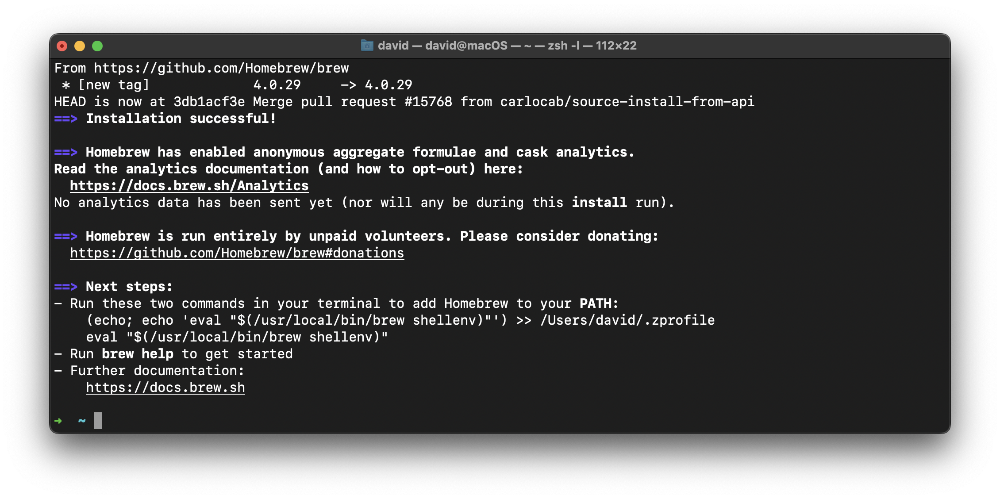

<h1>
  <span class="headline">Python Installfest</span>
  <span class="subhead">macOS</span>
</h1>

## What you need to begin

### _(you must read this, do not skip this, this is important)_

- **_A device running macOS 14 Sonoma or macOS 13 Ventura._**
- At least 10GB of free hard drive space.
- At least 8GB of RAM. 16GB of RAM or more is preferable and will improve your learning experience.
- A user account with administrative privilege to your local installation of macOS.
- A fundamental understanding of macOS system administration and debugging.

## What you'll install

By following this guide, you'll sign up for the following services:

- [GitHub Enterprise](#github-enterprise-ghe)

You'll install the following tools and software:

- [Homebrew](#homebrew)
- [Git](#git)
- [GitHub CLI](#github-cli)
- [Anaconda](#Anaconda)
- [Jupyter Notebook in Visual Studio Code](#jupyter-notebook-in-visual-studio-code)

Finally, you'll [set up the directory structure used in the course](#set-up-the-directory-structure-used-in-the-course).

### Note for Experienced Developers

If you already have the following programs installed and set up on your computer:

- A bash-based terminal environment
- Git
- GitHub CLI

in a way that differs from the instructions provided here **but works well for you and you’re familiar with it**, feel free to skip those sections of the Installfest.

If you are in doubt, we recommend following the guide provided to ensure consistency across the course. This will help avoid any unexpected issues later on.

## Troubleshooting

If you run into issues during Installfest, please reach out to your Installfest point of contact.

## A note on copying commands

When possible, **_please copy the commands from this page_**. You will use most of the commands here once and never again. Typing them out will only introduce the possibility of you making errors. Certain commands will require you to alter portions of them - this is specifically called out when they appear. There are no bonus points for doing work already done for you.

### Copying text in code blocks

To copy text from code blocks, use your mouse to hover over the code block. A **Copy** button will appear in the upper right corner. Click this, and the text held in the code block will be put on your clipboard, ready to be pasted.


## GitHub Enterprise (GHE)

You'll use General Assembly's private GitHub Enterprise instance (commonly abbreviated as GHE) throughout the course. If you think of GitHub as a social media platform for developers worldwide, you can think of GitHub Enterprise as a social media platform just for developers at General Assembly.

You can sign up for an account here: **[http://git-invite.generalassemb.ly/](http://git-invite.generalassemb.ly/)**

If you already have a GitHub account, you may use the same username for both GitHub & GHE accounts; however, we recommend that you distinguish between the two by appending **-ga** to your GitHub username, for example, **YourGitHubUsername-ga**.

## Homebrew

Homebrew is a package manager we will use to install various command-line tools in our class. Learn more [**here**](https://brew.sh).

In your terminal application, run this command:

```bash
/bin/bash -c "$(curl -fsSL https://raw.githubusercontent.com/Homebrew/install/HEAD/install.sh)"
```

You will be prompted to enter the user password for your device. Do so. It will not be displayed on the screen in any form as you type it - this is common for command-line password entry. After entering it, you will be prompted to allow the script to install various applications and create multiple directories, as shown in the screenshot below. Press <kbd>↩ Return</kbd> to allow this.

If you are prompted to install any Xcode tools, say yes.

Note that if you have a Mac with an Apple Silicon chip, your directory names may differ from those in this screenshot (likely starting with <code class="filepath">/opt/homebrew</code>). That's just fine!


### Next Steps _very important - you're not done yet!_



After completing the installation, you will likely be prompted to enter further commands found in the **Next steps** section in your terminal to finalize the installation. **_You must complete the actions in this prompt before proceeding._**

In the above output, we are told to **Run these two commands in your terminal to add Homebrew to your PATH:**


If you have a similar message, you **_must_** run the commands displayed in your terminal (feel free to copy and paste them!). <span class="warning">Do not enter the commands shown above. They will not work. You must copy the commands listed in your own terminal and run them.</span>

If no commands are shown under the **Next steps** section, you may continue.

## Git

Git is the version control software we will use in this course.

In your terminal application, run this command:

```bash
brew install git
```

### Git config

With Git installed, we can now make some configuration changes to make it a more effective tool. Complete all of the following configuration steps in your terminal.

Use the below command to add a user name to Git, which will be used to identify your commits. Replace `User Name` with a name of your choice. Make sure you leave the quotes surrounding your username. Keep the name somewhat professional, or just use your name - this will be used to identify your commits on GitHub. There will not be any output from this command.

```bash
git config --global user.name "User Name"
```

Next, use the below command to add an email to Git, which will be used to identify your commits.

Replace `user@email.com` with the email address associated with your [`https://git.generalassemb.ly`](https://git.generalassemb.ly) account. Ensure you leave the quotes surrounding your email. There will not be any output from this command.

```bash
git config --global user.email "user@email.com"
```

Set the default branch name to `main` with the below command. This will align the default branch name in Git with the default branch name on GitHub. There will be no output from this command.

```bash
git config --global init.defaultBranch main
```

Configure Git to track case changes in file names. There will not be any output from this command.

```bash
git config --global core.ignorecase false
```

## GitHub CLI

We'll use the GitHub command line utility to perform some actions on GitHub. Install it with this command in your terminal:

```bash
brew install gh
```

Once it is installed, you'll use it to log in to your General Assembly GitHub Enterprise account from the command line. Use this command:

```bash
gh auth login
```

You'll encounter a series of prompts to complete your login. Follow these steps:

1. You will be prompted to log in to a GitHub.com account or a GitHub Enterprise account. Select the **GitHub Enterprise Server** option.
2. Use `git.generalassemb.ly` as the GHE hostname.
3. Choose **HTTPS** as the preferred protocol for Git operations.
4. When asked to authenticate Git with your GitHub credentials, press <kbd>Y</kbd> and then <kbd>↩ Return</kbd>.
5. Select the **Login with a web browser** option when asked how you would like to authenticate.
6. Copy the one-time code from your terminal, then press the <kbd>↩ Return</kbd> key to open `https://git.generalassemb.ly/login/device` in your browser.
7. Paste the code you copied from the terminal, and hit continue.
8. Authorize the GitHub CLI when asked.
9. You may be asked to confirm your GHE account password. Do so.
10. The CLI app should update automatically to confirm that you're logged in. It should look something like this:

    ```plaintext
    ✓ Authentication complete.
    - gh config set -h git.generalassemb.ly git_protocol https
    ✓ Configured git protocol
    ✓ Logged in as student
    ```

You should now be able to interact with General Assembly's GitHub Enterprise from the command line!

## Set up the directory structure used in the course

Finally, let's set up the directory structure you'll use in the course. In your terminal, run these commands:

```bash
mkdir ~/code
mkdir ~/code/ga
mkdir ~/code/ga/labs ~/code/ga/lectures ~/code/ga/projects ~/code/ga/sandbox
```

Note the four directories we're creating in the <code class="filepath">~/code/ga</code> directory:

- <code class="filepath">lecture</code>: for your work while following along with the lecture content.
- <code class="filepath">labs</code>: for the lab assignments you create.
- <code class="filepath">projects</code>: for any projects you build in the course.
- <code class="filepath">sandbox</code>: for any quick experimentation.

All lecture material will assume you have this base directory structure, but if you'd like, you may further divide these directories based on topic, day/week, or any other method you choose.

## Anaconda

Anaconda is a powerful package manager and environment management system that comes pre-installed with Python, Jupyter Notebook, and many other essential data science packages like Pandas. By installing Anaconda, you'll be able to manage your Python environments easily and access a wide range of tools that are essential for this course.

### Install Anaconda

1. **Download the Installer:**

   - Visit the [Anaconda Distribution page](https://www.anaconda.com/products/distribution#download-section) and download the macOS installer. Make sure to select the version compatible with your macOS version.

2. **Run the Installer:**

   - Once the download is complete, open the `.pkg` file and follow the on-screen instructions to install Anaconda. This process will install the Anaconda distribution, which includes Python, Jupyter Notebook, and a suite of other useful packages.

3. **Verify the Installation:**

   - Open your terminal and run the following command to verify that Anaconda was installed correctly:

   ```bash
   conda --version
   ```

   - If Anaconda was installed successfully, this command will display the version of `conda` that you have installed.

### Setting Up Anaconda

1. **Initialize Anaconda:**

   - You may need to initialize Anaconda in your shell. Run the following command:

   ```bash
   conda init zsh
   ```

   - Restart your terminal for the changes to take effect.

2. **Create a New Environment:**

   - It’s a good practice to create a new environment for your python projects. This keeps dependencies isolated and your base environment clean. To create a new environment named `ga-env`, run:

   ```bash
   conda create -n ga-env python=3.11
   ```

   - Activate the environment with:

   ```bash
   conda activate ga-env
   ```

## Jupyter Notebook in Visual Studio Code

With Anaconda installed, you can now use Jupyter Notebooks directly within Visual Studio Code, which offers a powerful environment for writing and running Python code.

### Install the Jupyter Notebook Extension

1. **Open Visual Studio Code:**

   - If you haven't already installed VS Code, download and install it from the [Visual Studio Code website](https://code.visualstudio.com/).

2. **Install the Jupyter Extension:**

   - Open VS Code and click on the Extensions icon in the Activity Bar on the side of the window (or press <kbd>Ctrl</kbd> + <kbd>Shift</kbd> + <kbd>X</kbd>).
   - In the Extensions Marketplace, search for "Jupyter" and click **Install** on the Jupyter extension by Microsoft.

3. **Open or Create a Jupyter Notebook:**

   - To open an existing Jupyter Notebook (`.ipynb` file), simply double-click the file in the VS Code Explorer, and it will open with the Jupyter interface.
   - To create a new Jupyter Notebook, press <kbd>Ctrl</kbd> + <kbd>Shift</kbd> + <kbd>P</kbd> to open the Command Palette, then type "Jupyter: Create New Blank Notebook" and select it.

4. **Select Your Python Environment:**

   - If you’ve created the `ga-env` environment, you need to make sure it's selected as the active Python environment in VS Code.
   - Press <kbd>Cmd</kbd> + <kbd>Shift</kbd> + <kbd>P</kbd> to open the Command Palette.
   - In the Command Palette, start typing `Python: Select Interpreter` and select this option when it appears.
   - A list of available Python environments will show up. Look for `ga-env` in the list (it might include the full path to the environment and mention `conda` or `miniconda`).
   - Click on `ga-env` to select it as the active Python environment.

   If you don't see `ga-env` in the list, make sure the environment is activated in your terminal and VS Code is restarted.

### Running Jupyter Notebooks in VS Code

Once you've installed the Jupyter extension and opened or created a notebook, you can start writing and executing Python code directly within the notebook cells in VS Code.

- **Running Code Cells:**

  - You can run a code cell by clicking the "Run" button next to the cell or by pressing <kbd>Shift</kbd> + <kbd>Enter</kbd> while the cell is selected.

## You did it!

Great work completing Installfest! 🎉
