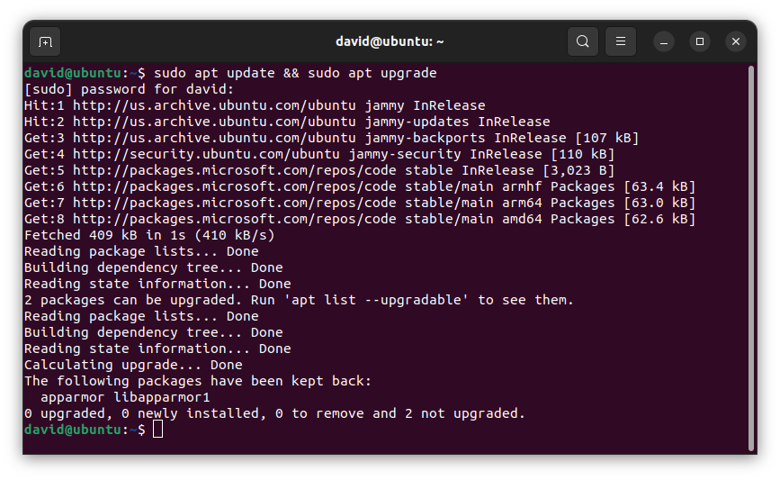

<h1>
  <span class="headline">Python Installfest</span>
  <span class="subhead">Ubuntu</span>
</h1>

## What you need to begin

### _(you must read this, do not skip this, this is important)_

- **_A device running Ubuntu 22.04 LTS (Jammy Jellyfish)._** Other versions of Ubuntu and flavors of Linux may be compatible with this Installfest, but they're not recommended.
- At least 10GB of free hard drive space.
- At least 8GB of RAM. 16GB of RAM or more is preferable and will improve your learning experience.
- A user account with administrative privilege to your local installation of Ubuntu.
- A fundamental understanding of Linux system administration and debugging.

## What you'll install

By following this guide, you'll sign up for the following services:

- [GitHub Enterprise](#github-enterprise-ghe)

You'll install the following tools and software:

- [Git](#git)
- [GitHub CLI](#github-cli)
- [Anaconda](#Anaconda)
- [Jupyter Notebook in Visual Studio Code](#jupyter-notebook-in-visual-studio-code)

Finally, you'll [set up the directory structure used in the course](#set-up-the-directory-structure-used-in-the-course).

### Note for Experienced Developers

If you already have the following programs installed and configured on your computer:

- A bash-based terminal environment
- Git
- GitHub CLI

and they are set up differently from the instructions provided here **but are working well for you**, feel free to skip those sections of the Installfest.

However, if you’re unsure whether your setup is compatible, we recommend following the guide provided to ensure consistency across the course. This will help prevent any unexpected issues later on.

## Troubleshooting

If you run into issues during Installfest, please reach out to your Installfest point of contact.

## A note on copying commands

When possible, **_please copy the commands from this page_**. You will use most of the commands here once and never again. Typing them out will only introduce the possibility of you making errors. Certain commands will require you to alter portions of them - this is specifically called out when they appear. There are no bonus points for doing work already done for you.

### Copying text in code blocks

To copy text from code blocks, use your mouse to hover over the code block. A **Copy** button will appear in the upper right corner. Click this, and the text held in the code block will be put on your clipboard, ready to be pasted. By default, you'll need to use <kbd>Ctrl</kbd> + <kbd>Shift</kbd> + <kbd>V</kbd> to paste into the Ubuntu terminal.


## GitHub Enterprise (GHE)

You'll use General Assembly's private GitHub Enterprise instance (commonly abbreviated as GHE) throughout the course. If you think of GitHub as a social media platform for developers worldwide, you can think of GitHub Enterprise as a social media platform just for developers at General Assembly.

You can sign up for an account here: **[http://git-invite.generalassemb.ly/](http://git-invite.generalassemb.ly/)**

If you already have a GitHub account, you may use the same username for both GitHub & GHE accounts; however, we recommend that you distinguish between the two by appending **-ga** to your GitHub username, for example, **YourGitHubUsername-ga**.

## Updating and upgrading packages

Launch your terminal application now.

Your Linux installation will not automatically perform updates, but we'll want the latest versions of everything for the best experience. Run this command now to update your installed packages manually:

```bash
sudo apt update && sudo apt upgrade
```

You'll be prompted to provide your user password and accept the changes that need to be made. Do so. As you type your password in, you'll notice it doesn't appear in the terminal. This is normal for password entry; keep typing it in and hit <kbd>↩ Enter</kbd> when you're done.



Above, you can see a potential output of the command to update Ubuntu packages. Your output may be different from this, but that's okay!

## Git

Ensure you have access to the most recent stable version of Git with this command:

```bash
sudo add-apt-repository ppa:git-core/ppa
```

You may be prompted for your Ubuntu password. If you are, enter it. When prompted to continue, press <kbd>↩ Enter</kbd>. If you encounter an error during this process, check out the **Handling errors 💔** sub-section below.

Then run this command:

```bash
sudo apt-get update
```

and then finally, use this command to install Git on your machine:

```bash
sudo apt-get install git
```

Enter **`Y`** when prompted to continue.

### Handling errors 💔

After running the `sudo add-apt-repository ppa:git-core/ppa` command above, you may encounter an `HTTPError`. If you do, ensure that your system date and time are correct, then try the same command again. If this does not resolve your issue, reach out to your Installfest point of contact for assistance!

### Git config

With Git installed, we can now make some configuration changes to make it a more effective tool. Complete all of the following configuration steps in your terminal.

Use the below command to add a user name to Git, which will be used to identify your commits. Replace `User Name` with a name of your choice. Make sure you leave the quotes surrounding your username. Keep the name somewhat professional, or just use your name - this will be used to identify your commits on GitHub. There will not be any output from this command.

```bash
git config --global user.name "User Name"
```

Next, use the below command to add an email to Git, which will be used to identify your commits.

Replace `user@email.com` with the email address associated with your [`https://git.generalassemb.ly`](https://git.generalassemb.ly) account. Ensure you leave the quotes surrounding your email. There will not be any output from this command.

```bash
git config --global user.email "user@email.com"
```

Set the default branch name to `main` with the below command. This will align the default branch name in Git with the default branch name on GitHub. There will be no output from this command.

```bash
git config --global init.defaultBranch main
```

Configure Git to track case changes in file names. There will not be any output from this command.

```bash
git config --global core.ignorecase false
```

## GitHub CLI

We'll use the GitHub command line utility to perform some actions on GitHub. Install it with this command in your terminal:

```bash
(type -p wget >/dev/null || (sudo apt update && sudo apt-get install wget -y)) \
&& sudo mkdir -p -m 755 /etc/apt/keyrings \
&& wget -qO- https://cli.github.com/packages/githubcli-archive-keyring.gpg | sudo tee /etc/apt/keyrings/githubcli-archive-keyring.gpg > /dev/null \
&& sudo chmod go+r /etc/apt/keyrings/githubcli-archive-keyring.gpg \
&& echo "deb [arch=$(dpkg --print-architecture) signed-by=/etc/apt/keyrings/githubcli-archive-keyring.gpg] https://cli.github.com/packages stable main" | sudo tee /etc/apt/sources.list.d/github-cli.list > /dev/null \
&& sudo apt update \
&& sudo apt install gh -y
```

If you have errors, check out potential solutions to them in the **Handling errors 💔** sub-section below. Otherwise, skip to the **Authenticate with `gh`** sub-section.

### Handling errors 💔

If you get this error:

```plaintext
gpg: failed to start the dirmngr '/usr/bin/dirmngr': No such file or directory
```

Try installing the `dirmngr` package with this command:

```bash
sudo apt-get install dirmngr
```

Then, repeat the installation steps above.

### Authenticate with `gh`

Once it is installed, you'll use it to log in to your General Assembly GitHub Enterprise account from the command line. Use this command:

```bash
gh auth login
```

You'll encounter a series of prompts to complete your login. Follow these steps:

1. You will be prompted to log in to a GitHub.com account or a GitHub Enterprise account. Select the **GitHub Enterprise Server** option.
2. Use `git.generalassemb.ly` as the GHE hostname.
3. Choose **HTTPS** as the preferred protocol for Git operations.
4. When asked to authenticate Git with your GitHub credentials, press <kbd>Y</kbd> and then <kbd>↩ Enter</kbd>.
5. Select the **Login with a web browser** option when asked how you would like to authenticate.
6. Copy the one-time code from your terminal, then press the <kbd>↩ Enter</kbd> key to open `https://git.generalassemb.ly/login/device` in your browser.
7. Paste the code you copied from the terminal, and hit continue.
8. Authorize the GitHub CLI when asked.
9. You may be asked to confirm your GHE account password. Do so.
10. The CLI app should update automatically to confirm that you're logged in. It should look something like this:

    ```plaintext
    ✓ Authentication complete.
    - gh config set -h git.generalassemb.ly git_protocol https
    ✓ Configured git protocol
    ✓ Logged in as student
    ```

You should now be able to interact with General Assembly's GitHub Enterprise from the command line!

## Set up the directory structure used in the course

Finally, let's set up the directory structure you'll use in the course. In your terminal, run these commands:

```bash
mkdir ~/code
mkdir ~/code/ga
mkdir ~/code/ga/labs ~/code/ga/lectures ~/code/ga/projects ~/code/ga/sandbox
```

Note the four directories we're creating in the <code class="filepath">~/code/ga</code> directory:

- <code class="filepath">lecture</code>: for your work while following along with the lecture content.
- <code class="filepath">labs</code>: for the lab assignments you create.
- <code class="filepath">projects</code>: for any projects you build in the course.
- <code class="filepath">sandbox</code>: for any quick experimentation.

All lecture material will assume you have this base directory structure, but if you'd like, you may further divide these directories based on topic, day/week, or any other method you choose.

## Anaconda

Anaconda is a powerful package manager and environment management system that comes pre-installed with Python, Jupyter Notebook, and many other essential data science packages like Pandas. By installing Anaconda, you'll be able to manage your Python environments easily and access a wide range of tools that are essential for this course.

### Install Anaconda

1. **Download the Installer:**

   - Visit the [Anaconda Distribution page](https://www.anaconda.com/products/distribution#download-section) and download the Linux installer.

   - Alternatively, you can download the installer directly from your terminal with the following command:

   \```bash
   wget https://repo.anaconda.com/archive/Anaconda3-[VERSION]-Linux-x86_64.sh
   \```

   - Replace `[VERSION]` with the latest version number found on the [Anaconda website](https://www.anaconda.com/products/distribution#download-section) to ensure you're downloading the most recent release.

2. **Run the Installer:**

   - Once the download is complete, you need to run the installer. In your terminal, navigate to the directory where the installer was downloaded (usually your home directory) and run the following command:

   ```bash
   bash Anaconda3-[VERSION]-Linux-x86_64.sh
   ```

   - Follow the on-screen instructions. You’ll be prompted to review the license agreement, confirm the installation location, and choose whether to initialize Anaconda.

3. **Initialize Anaconda:**

   - During the installation process, you'll be asked if you want to initialize Anaconda3 by running `conda init`. Accept this option by typing `yes` and pressing <kbd>↩ Enter</kbd>. This will set up your shell to use `conda`.

4. **Verify the Installation:**

   - After the installation is complete, restart your terminal or run the following command to activate the changes:

   ```bash
   source ~/.bashrc
   ```

   - Then, verify that Anaconda was installed correctly by checking the `conda` version:

   ```bash
   conda --version
   ```

   - If Anaconda was installed successfully, this command will display the version of `conda` that you have installed.

### Setting Up Anaconda

1. **Create a New Environment:**

   - It’s a good practice to create a new environment for your Python projects. This keeps dependencies isolated and your base environment clean. To create a new environment named `ga-env`, run:

   ```bash
   conda create -n ga-env python=3.11
   ```

   - Activate the environment with:

   ```bash
   conda activate ga-env
   ```

2. **Install Jupyter Notebook:**

   - With your environment activated, install Jupyter Notebook by running:

   ```bash
   conda install jupyter
   ```

   - This will allow you to work with Jupyter Notebooks directly within this environment if needed.

## Jupyter Notebook in Visual Studio Code

With Anaconda installed, you can now use Jupyter Notebooks directly within Visual Studio Code, which offers a powerful environment for writing and running Python code.

1. **Open Visual Studio Code:**

   - If you haven't already installed VS Code, download and install it from the [Visual Studio Code website](https://code.visualstudio.com/).

2. **Install the Jupyter Extension:**

   - Open VS Code and click on the Extensions icon in the Activity Bar on the side of the window (or press <kbd>Ctrl</kbd> + <kbd>Shift</kbd> + <kbd>X</kbd>).
   - In the Extensions Marketplace, search for "Jupyter" and click **Install** on the Jupyter extension by Microsoft.

3. **Open or Create a Jupyter Notebook:**

   - To open an existing Jupyter Notebook (`.ipynb` file), simply double-click the file in the VS Code Explorer, and it will open with the Jupyter interface.
   - To create a new Jupyter Notebook, press <kbd>Ctrl</kbd> + <kbd>Shift</kbd> + <kbd>P</kbd> to open the Command Palette, then type "Jupyter: Create New Blank Notebook" and select it.

4. **Select Your Python Environment:**

   - If you’ve created the `ga-env` environment, you need to make sure it's selected as the active Python environment in VS Code.
   - Press <kbd>Ctrl</kbd> + <kbd>Shift</kbd> + <kbd>P</kbd> to open the Command Palette.
   - In the Command Palette, start typing `Python: Select Interpreter` and select this option when it appears.
   - A list of available Python environments will show up. Look for `ga-env` in the list (it might include the full path to the environment and mention `conda` or `miniconda`).
   - Click on `ga-env` to select it as the active Python environment.

   If you don't see `ga-env` in the list, make sure the environment is activated in your terminal and VS Code is restarted.

### Running Jupyter Notebooks in VS Code

Once you've installed the Jupyter extension and opened or created a notebook, you can start writing and executing Python code directly within the notebook cells in VS Code.

- **Running Code Cells:**

  - You can run a code cell by clicking the "Run" button next to the cell or by pressing <kbd>Shift</kbd> + <kbd>Enter</kbd> while the cell is selected.

## You did it!

Great work completing Installfest! 🎉
