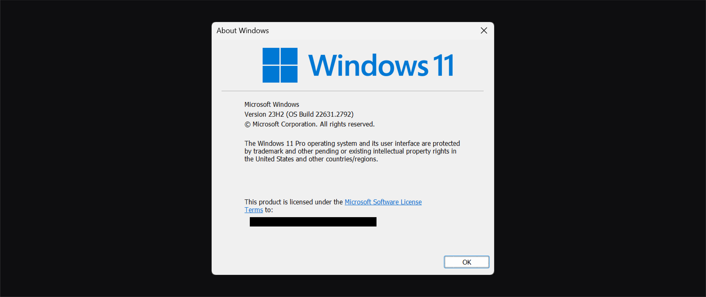
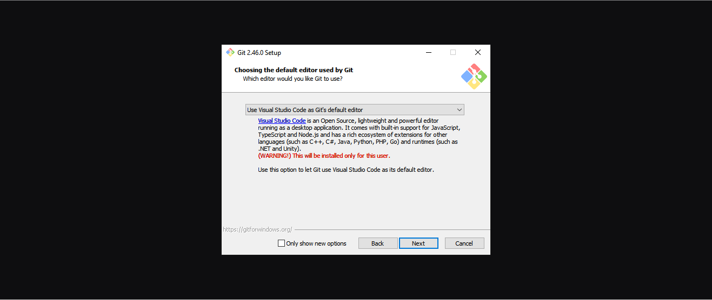
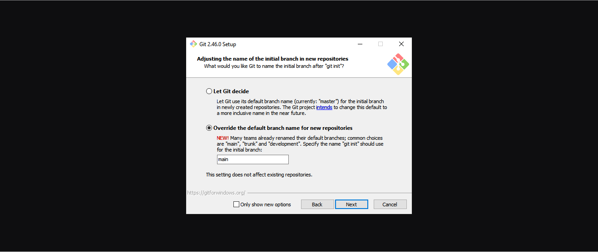
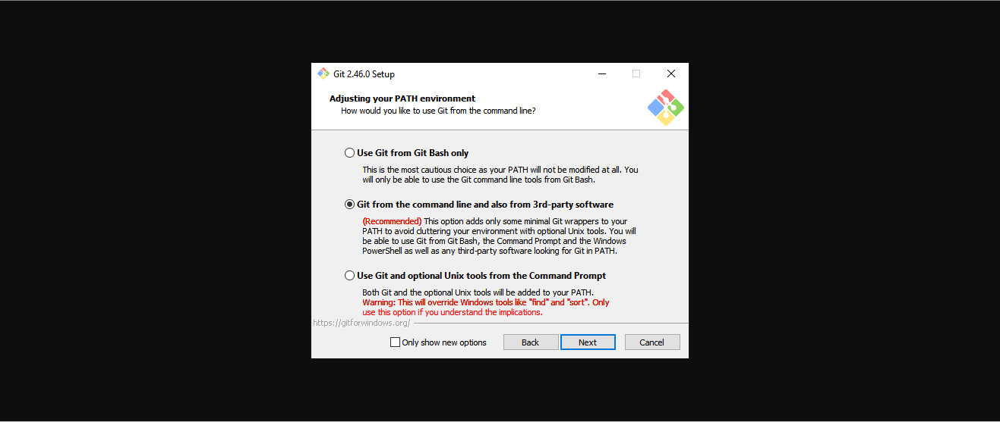

<h1>
  <span class="headline">Python Installfest</span>
  <span class="subhead">Windows</span>
</h1>

## What you need to begin

### _(you must read this, do not skip this, this is important)_

- **_A device running Windows 11 version 23H2 (OS Build 22631 or greater) or Windows 10 version 22H2 (OS Build 19045 or greater)._**

  To find your Windows version and build number, use <kbd>⊞ Windows</kbd> + <kbd>R</kbd> on your keyboard, type **`winver`**, and select **OK**. You'll see a dialog window like the one below (it will look slightly different in Windows 10). Note the Version: 23H2.

  

- At least 10GB of free hard drive space.
- At least 8GB of RAM. 16GB of RAM or more is preferable and will improve your learning experience.
- A user account with administrative privilege to your local installation of Windows.
- A fundamental understanding of Windows system administration and debugging.

## What you'll install

By following this guide, you'll sign up for the following services:

- [GitHub Enterprise](#github-enterprise-ghe)

You'll install the following tools and software:

- [Git](#git)
- [GitHub CLI](#github-cli)
- [Anaconda](#Anaconda)
- [Jupyter Notebook in Visual Studio Code](#jupyter-notebook-in-visual-studio-code)

Finally, you'll [set up the directory structure used in the course](#set-up-the-directory-structure-used-in-the-course).

### Note for Experienced Developers

If you already have the following programs installed and set up on your computer:

- A bash-based terminal environment
- Git
- GitHub CLI

in a way that differs from the instructions provided here **but works well for you and you’re familiar with it**, feel free to skip those sections of the Installfest.

If you are in doubt, we recommend following the guide provided to ensure consistency across the course. This will help avoid any unexpected issues later on.

## Troubleshooting

If you run into issues during Installfest, please reach out to your Installfest point of contact.

## A note on copying commands

When possible, **_please copy the commands from this page_**. You will use most of the commands here once and never again. Typing them out will only introduce the possibility of you making errors. Certain commands will require you to alter portions of them - this is specifically called out when they appear. There are no bonus points for doing work already done for you.

### Copying text in code blocks

To copy text from code blocks, use your mouse to hover over the code block. A **Copy** button will appear in the upper right corner. Click this, and the text held in the code block will be put on your clipboard, ready to be pasted.


## GitHub Enterprise (GHE)

You'll use General Assembly's private GitHub Enterprise instance (commonly abbreviated as GHE) throughout the course. If you think of GitHub as a social media platform for developers worldwide, you can think of GitHub Enterprise as a social media platform just for developers at General Assembly.

You can sign up for an account here: **[http://git-invite.generalassemb.ly/](http://git-invite.generalassemb.ly/)**

If you already have a GitHub account, you may use the same username for both GitHub & GHE accounts; however, we recommend that you distinguish between the two by appending **-ga** to your GitHub username, for example, **YourGitHubUsername-ga**.

## Git

Git is the version control software we will use in this course.

Download Git for Windows from [this download page](https://git-scm.com/downloads). Run the downloaded file.

**_You will be given many prompts on features to install and choices to make while installing Git. All of these may be left as their default, except for the ones below._**

You should use a text editor you feel comfortable working in as Git's default editor. Visual Studio Code has been selected in this screenshot, but you can use any text editor you'd like.



We'll use the `main` branch as the default when creating new repos locally. This will align the default branch name in Git with the default branch name on GitHub.



The following options should already be selected as the default, but pay special attention to them as they are important:

On the **Adjusting your PATH environment** step, select the **Git from the command line and also from 3rd-party software** option. This allows you to interact with Git from 3rd party apps and CLIs other than Git Bash.



On the **Configuring the line ending conversions** step, Select the **Checkout Windows-style, commit Unix-style line endings** option. This ensures interoperability between code written on macOS/Linux and Windows.


### Git Bash config

When the installation is complete, launch the newly installed Git Bash app.

While optional, we can make one quality-of-life change to interact with Git Bash more easily. By default, the keyboard combination to copy and paste in the Git Bash app is <kbd>Ctrl</kbd> + <kbd>Ins</kbd> (Copy) and <kbd>Shift</kbd> + <kbd>Ins</kbd> (Paste). These keyboard combination is not intuitive to most people, and many keyboards do not have the <kbd>Ins</kbd> key. Luckily, we're able to change it.

> 🧠 Want to leave this setting as it is? Continue to the **Git config** section below.

With Git Bash open, right-click the app's title bar and select the **Options...** option.

In the **Options** window, select **Keys** from the left navigation, then check the **Ctrl+Shift+letter shortcuts** checkbox, and then save the change with the **Save** button.

With this setting on, you can now use <kbd>Ctrl</kbd> + <kbd>Shift</kbd> + <kbd>C</kbd> to copy text from Git Bash and <kbd>Ctrl</kbd> + <kbd>Shift</kbd> + <kbd>V</kbd> to paste text in Git Bash. While this is still an adjustment from the regular copy/paste action, it should feel somewhat familiar.

### Git config

With Git installed and the Git Bash app open, we can now make some configuration changes to make it a more effective tool. Complete all of the following configuration steps in Git Bash.

Use the below command to add a user name to Git, which will be used to identify your commits. Replace `User Name` with a name of your choice. Make sure you leave the quotes surrounding your username. Keep the name somewhat professional, or just use your name - this will be used to identify your commits on GitHub. There will not be any output from this command.

```bash
git config --global user.name "User Name"
```

Next, use the below command to add an email to Git, which will be used to identify your commits.

Replace `user@email.com` with the email address associated with your [`https://git.generalassemb.ly`](https://git.generalassemb.ly) account. Ensure you leave the quotes surrounding your email. There will not be any output from this command.

```bash
git config --global user.email "user@email.com"
```

Configure Git to track case changes in file names. There will not be any output from this command.

```bash
git config --global core.ignorecase false
```

## GitHub CLI

We'll use the GitHub command line utility to perform some actions on GitHub. Install it with this command in your terminal:

```bash
winget install --id GitHub.cli
```

Follow the prompts for any user agreements. You'll need to provide system administrator access as part of the installation.

Once it is installed, you'll use it to log in to your General Assembly GitHub Enterprise account from the command line. Use this command:

```bash
gh auth login
```

You'll encounter a series of prompts to complete your login. Follow these steps:

1. You will be prompted to log in to a GitHub.com account or a GitHub Enterprise account. Select the **GitHub Enterprise Server** option.
2. Use `git.generalassemb.ly` as the GHE hostname.
3. Choose **HTTPS** as the preferred protocol for Git operations.
4. When asked to authenticate Git with your GitHub credentials, press <kbd>Y</kbd> and then <kbd>↩ Enter</kbd>.
5. Select the **Login with a web browser** option when asked how you would like to authenticate.
6. Copy the one-time code from your terminal, then press the <kbd>↩ Enter</kbd> key to open `https://git.generalassemb.ly/login/device` in your browser.
7. Paste the code you copied from the terminal, and hit continue.
8. Authorize the GitHub CLI when asked.
9. You may be asked to confirm your GHE account password. Do so.
10. The CLI app should update automatically to confirm that you're logged in. It should look something like this:

    ```plaintext
    ✓ Authentication complete.
    - gh config set -h git.generalassemb.ly git_protocol https
    ✓ Configured git protocol
    ✓ Logged in as student
    ```

You should now be able to interact with General Assembly's GitHub Enterprise from the command line!

## Set up the directory structure used in the course

Finally, let's set up the directory structure you'll use in the course. In your terminal, run these commands:

```bash
mkdir ~/code
mkdir ~/code/ga
mkdir ~/code/ga/labs ~/code/ga/lectures ~/code/ga/projects ~/code/ga/sandbox
```

Note the four directories we're creating in the <code class="filepath">~/code/ga</code> directory:

- <code class="filepath">lecture</code>: for your work while following along with the lecture content.
- <code class="filepath">labs</code>: for the lab assignments you create.
- <code class="filepath">projects</code>: for any projects you build in the course.
- <code class="filepath">sandbox</code>: for any quick experimentation.

All lecture material will assume you have this base directory structure, but if you'd like, you may further divide these directories based on topic, day/week, or any other method you choose.

## Anaconda

Anaconda is a powerful package manager and environment management system that comes pre-installed with Python, Jupyter Notebook, and many other essential data science packages like Pandas. By installing Anaconda, you'll be able to manage your Python environments easily and access a wide range of tools that are essential for this course.

### Install Anaconda

1. **Download the Installer:**

   - Visit the [Anaconda Distribution page](https://www.anaconda.com/products/distribution#download-section) and download the Windows installer. Make sure to select the version compatible with your Windows version.

2. **Run the Installer:**

   - Once the download is complete, run the installer and follow the on-screen instructions to install Anaconda. Make sure to check the option to add Anaconda to your system's `PATH` environment variable during the installation.

3. **Verify the Installation:**

   - Open Git Bash (or any terminal) and run the following command to verify that Anaconda was installed correctly:

   ```bash
   conda --version
   ```

   - If Anaconda was installed successfully, this command will display the version of `conda` that you have installed.

### Setting Up Anaconda

1. **Initialize Anaconda:**

   - You may need to initialize Anaconda in your terminal. Run the following command:

   ```bash
   conda init bash
   ```

   - Restart your terminal for the changes to take effect.

2. **Create a New Environment:**

   - It’s a good practice to create a new environment for your Python projects. This keeps dependencies isolated and your base environment clean. To create a new environment named `ga-env`, run:

   ```bash
   conda create -n ga-env python=3.11
   ```

   - Activate the environment with:

   ```bash
   conda activate ga-env
   ```

## Jupyter Notebook in Visual Studio Code

With Anaconda installed, you can now use Jupyter Notebooks directly within Visual Studio Code, which offers a powerful environment for writing and running Python code.

### Install the Jupyter Notebook Extension

1. **Open Visual Studio Code:**

   - If you haven't already installed VS Code, download and install it from the [Visual Studio Code website](https://code.visualstudio.com/).

2. **Install the Jupyter Extension:**

   - Open VS Code and click on the Extensions icon in the Activity Bar on the side of the window (or press <kbd>Ctrl</kbd> + <kbd>Shift</kbd> + <kbd>X</kbd>).
   - In the Extensions Marketplace, search for "Jupyter" and click **Install** on the Jupyter extension by Microsoft.

3. **Open or Create a Jupyter Notebook:**

   - To open an existing Jupyter Notebook (`.ipynb` file), simply double-click the file in the VS Code Explorer, and it will open with the Jupyter interface.
   - To create a new Jupyter Notebook, press <kbd>Ctrl</kbd> + <kbd>Shift</kbd> + <kbd>P</kbd> to open the Command Palette, then type "Jupyter: Create New Blank Notebook" and select it.

4. **Select Your Python Environment:**

   - Ensure that your Python environment is selected. If you’ve created the `ga-env` environment, select it by clicking on the Python version displayed in the bottom left corner of VS Code and choosing `ga-env` from the list.

### Running Jupyter Notebooks in VS Code

Once you've installed the Jupyter extension and opened or created a notebook, you can start writing and executing Python code directly within the notebook cells in VS Code.

- **Running Code Cells:**

  - You can run a code cell by clicking the "Run" button next to the cell or by pressing <kbd>Shift</kbd> + <kbd>Enter</kbd> while the cell is selected.

- **Saving Your Work:**

  - Don’t forget to save your work frequently. You can do this by pressing <kbd>Ctrl</kbd> + <kbd>S</kbd>.

This setup allows you to leverage the full power of VS Code while working with Jupyter Notebooks, offering a seamless and integrated development experience.

## You did it!

Great work completing Installfest! 🎉
